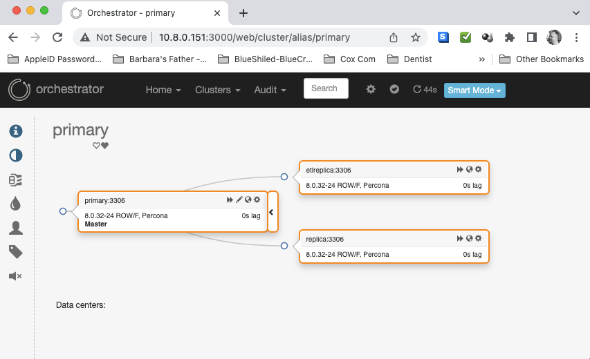

# data-sync
This is my Percona GTID Test Lab. I use this to test out Percona GTID replication and failover.


## Requirements
- Vagrant
- Ansible
- VirtualBox
- ssh-audits
- Use this branch as it can read and use the Ansible inventory file https://github.com/ChaosHour/ssh-audits/tree/feature/protected-priv-key

## Setup
```bash
You will need to adjust the Vagrantfile to use your own ip and NicCard:
proxysql.vm.network :public_network, :ip => "10.8.0.150", :bridge => "en6: AX88179A", :use_dhcp_assigned_default_route => true
                                      Changeme ^               Changeme ^

Also some variables for the user and password to be seeded into the VMs:
NEW_USER_NAME = "klarsen"
            changeme ^
NEW_USER_PASSWORD = "ou812"
            changeme ^
```


## How to use
Clone this repo
- Run `vagrant status` to see the status of the VMs
- Run `vagrant up` to start the VMs
- Run `ansible -i inventory all -m ping` to verify the VMs are up and running
- Run `ansible-playbook -i inventory --vault-id percona@password_file build.yml` to provision the VMs

> The reason I don't use `vagrant provision` is because I want to provision the VMs as if I were doing it in production.

## VMs
- `Orchestator` - Latest
- `ProxySQL`    - Latest
- `Primary`     - Percona MySQL 8
- `Replica`     - Percona MySQL 8
- `Etlreplica`  - Percona MySQL 8

```bash
klarsen@Mac-Book-Pro2 data-sync % vagrant status
Current machine states:

proxysql                  running (virtualbox)
orchestrator              running (virtualbox)
primary                   running (virtualbox)
replica                   running (virtualbox)
etlreplica                running (virtualbox)


==> etlreplica: Running provisioner: shell...
    etlreplica: Running: inline script
    etlreplica: There are 4 choices for the alternative editor (providing /usr/bin/editor).
    etlreplica:
    etlreplica:   Selection    Path                Priority   Status
    etlreplica: ------------------------------------------------------------
    etlreplica: * 0            /bin/nano            40        auto mode
    etlreplica:   1            /bin/ed             -100       manual mode
    etlreplica:   2            /bin/nano            40        manual mode
    etlreplica:   3            /usr/bin/vim.basic   30        manual mode
    etlreplica:   4            /usr/bin/vim.tiny    15        manual mode
    etlreplica:
    etlreplica: Press <enter> to keep the current choice[*], or type selection number: update-alternatives: using /usr/bin/vim.basic to provide /usr/bin/editor (editor) in manual mode


(data-sync) klarsen@Mac-Book-Pro2 data-sync % ansible -i inventory all -m ping
primary | SUCCESS => {
    "changed": false,
    "ping": "pong"
}
proxysql | SUCCESS => {
    "changed": false,
    "ping": "pong"
}
replica | SUCCESS => {
    "changed": false,
    "ping": "pong"
}
etlreplica | SUCCESS => {
    "changed": false,
    "ping": "pong"
}
orchestrator | SUCCESS => {
    "changed": false,
    "ping": "pong"
}


(data-sync) klarsen@Mac-Book-Pro2 data-sync % ansible-playbook -i inventory --vault-id percona@password_file build.yml

PLAY [Build Play] ********************************************************************************************************

TASK [percona : include_tasks] *******************************************************************************************
included: /projects/data-sync/roles/percona/tasks/pre-install.yml for primary, replica, etlreplica, proxysql, orchestrator

TASK [percona : Ensure the timeezone is set to utc] **********************************************************************
changed: [etlreplica]
changed: [proxysql]
changed: [replica]
changed: [orchestrator]
changed: [primary]

TASK [percona : System, install some base packages] **********************************************************************
changed: [etlreplica]
changed: [replica]
changed: [primary]
changed: [orchestrator]
changed: [proxysql]

TASK [percona : Mount a device by label] **********************************************************************************
changed: [replica]
changed: [orchestrator]
changed: [primary]
changed: [proxysql]
changed: [etlreplica]

TASK [percona : download the Percona repo] **********************************************************************************
changed: [orchestrator]
changed: [replica]
changed: [etlreplica]
changed: [proxysql]
changed: [primary]

TASK [percona : install the percona repo] ***********************************************************************************
changed: [replica]
changed: [etlreplica]
changed: [orchestrator]
changed: [primary]
changed: [proxysql]

TASK [percona : apply the changes] ******************************************************************************************
changed: [primary]
changed: [etlreplica]
changed: [replica]
changed: [proxysql]
changed: [orchestrator]

TASK [percona : System, set the swappiness to one] ***********************************************************************
changed: [orchestrator]
changed: [proxysql]
changed: [replica]
changed: [etlreplica]
changed: [primary]

TASK [percona : Enable percona] ******************************************************************************************
changed: [etlreplica]
changed: [replica]
changed: [proxysql]
changed: [primary]
changed: [orchestrator]

TASK [percona : Set the MySQL root password for the server] ***************************************************************
skipping: [proxysql]
changed: [primary]
changed: [replica]
changed: [etlreplica]
changed: [orchestrator]

TASK [percona : Install Percona] ******************************************************************************************
skipping: [proxysql]
changed: [primary]
changed: [replica]
changed: [etlreplica]
changed: [orchestrator]

TASK [percona : Install Percona | ProxySQL] **********************************************************************************
skipping: [primary]
skipping: [replica]
skipping: [etlreplica]
skipping: [orchestrator]
changed: [proxysql]

TASK [percona : Build and Copy my dot cnf] ***********************************************************************************
skipping: [proxysql]
changed: [primary]
changed: [etlreplica]
changed: [orchestrator]
changed: [replica]

TASK [percona : meta] ********************************************************************************************************

RUNNING HANDLER [replication : Restart MySQL] *******************************************************************************
skipping: [primary]
skipping: [orchestrator]
changed: [etlreplica]
changed: [replica]

TASK [percona : include_tasks] ***********************************************************************************************
included: /projects/data-sync/roles/percona/tasks/post-install.yml for primary, replica, etlreplica, proxysql, orchestrator

TASK [percona : Copy .my.cnf file with root password credentials] **********************************************************
skipping: [proxysql]
changed: [primary]
changed: [replica]
changed: [etlreplica]
changed: [orchestrator]

TASK [percona : Create backup dir under /root] *****************************************************************************
skipping: [proxysql]
changed: [primary]
changed: [replica]
changed: [etlreplica]
changed: [orchestrator]

TASK [percona : Download Orchestrator Client with checksum (sha256)] ******************************************************
skipping: [orchestrator]
changed: [proxysql]
changed: [replica]
changed: [etlreplica]
changed: [primary]

TASK [percona : Install Orchestrator Client] *****************************************************************************
skipping: [orchestrator]
changed: [proxysql]
changed: [replica]
changed: [etlreplica]
changed: [primary]

TASK [percona : Install | percona-toolkit | xtrabackup] ****************************************************************
skipping: [proxysql]
changed: [primary]
changed: [etlreplica]
changed: [replica]
changed: [orchestrator]

TASK [percona : Sudoers Add User] ***************************************************************************************
changed: [proxysql]
changed: [orchestrator]
changed: [replica]
changed: [etlreplica]
changed: [primary]

TASK [percona : Restart MyQSL] *******************************************************************************************
skipping: [replica]
skipping: [etlreplica]
skipping: [proxysql]
skipping: [orchestrator]
changed: [primary]

TASK [percona : Generate file] *****************************************************************************************
changed: [etlreplica]
changed: [proxysql]
changed: [primary]
changed: [orchestrator]
changed: [replica]

TASK [percona : print result] ****************************************************************************************
ok: [primary] => {
    "msg": {
        "backup_file": "/etc/hosts.4462.2023-04-23@18:10:28~",
        "changed": true,
        "diff": [
            {
                "after": "",
                "after_header": "/etc/hosts (content)",
                "before": "",
                "before_header": "/etc/hosts (content)"
            },
            {
                "after_header": "/etc/hosts (file attributes)",
                "before_header": "/etc/hosts (file attributes)"
            }
        ],
        "failed": false,
        "msg": "Block inserted"
    }
}
ok: [replica] => {
    "msg": {
        "backup_file": "/etc/hosts.4457.2023-04-23@18:10:07~",
        "changed": true,
        "diff": [
            {
                "after": "",
                "after_header": "/etc/hosts (content)",
                "before": "",
                "before_header": "/etc/hosts (content)"
            },
            {
                "after_header": "/etc/hosts (file attributes)",
                "before_header": "/etc/hosts (file attributes)"
            }
        ],
        "failed": false,
        "msg": "Block inserted"
    }
}
ok: [etlreplica] => {
    "msg": {
        "backup_file": "/etc/hosts.4449.2023-04-23@18:10:11~",
        "changed": true,
        "diff": [
            {
                "after": "",
                "after_header": "/etc/hosts (content)",
                "before": "",
                "before_header": "/etc/hosts (content)"
            },
            {
                "after_header": "/etc/hosts (file attributes)",
                "before_header": "/etc/hosts (file attributes)"
            }
        ],
        "failed": false,
        "msg": "Block inserted"
    }
}
ok: [proxysql] => {
    "msg": {
        "backup_file": "/etc/hosts.3584.2023-04-23@18:10:25~",
        "changed": true,
        "diff": [
            {
                "after": "",
                "after_header": "/etc/hosts (content)",
                "before": "",
                "before_header": "/etc/hosts (content)"
            },
            {
                "after_header": "/etc/hosts (file attributes)",
                "before_header": "/etc/hosts (file attributes)"
            }
        ],
        "failed": false,
        "msg": "Block inserted"
    }
}
ok: [orchestrator] => {
    "msg": {
        "backup_file": "/etc/hosts.4208.2023-04-23@18:10:22~",
        "changed": true,
        "diff": [
            {
                "after": "",
                "after_header": "/etc/hosts (content)",
                "before": "",
                "before_header": "/etc/hosts (content)"
            },
            {
                "after_header": "/etc/hosts (file attributes)",
                "before_header": "/etc/hosts (file attributes)"
            }
        ],
        "failed": false,
        "msg": "Block inserted"
    }
}

TASK [percona : include_tasks] ****************************************************************************************
included: /projects/data-sync/roles/percona/tasks/usermaint.yml for primary, replica, etlreplica, proxysql, orchestrator

TASK [percona : Set root password] ***********************************************************************************
skipping: [proxysql]
skipping: [orchestrator]
changed: [primary]
changed: [replica]
changed: [etlreplica]

TASK [percona : Create proxy User] ************************************************************************************
skipping: [proxysql]
skipping: [orchestrator]
changed: [primary]
changed: [replica]
changed: [etlreplica]

TASK [percona : Create Orchestrator User] ***************************************************************************
skipping: [proxysql] => (item=10.%)
skipping: [proxysql] => (item=localhost)
changed: [primary] => (item=10.%)
changed: [replica] => (item=10.%)
changed: [etlreplica] => (item=10.%)
changed: [orchestrator] => (item=10.%)
changed: [primary] => (item=localhost)
changed: [replica] => (item=localhost)
changed: [etlreplica] => (item=localhost)
changed: [orchestrator] => (item=localhost)

TASK [percona : Create Replication User] ***************************************************************************
skipping: [proxysql]
skipping: [orchestrator]
changed: [primary]
changed: [replica]
changed: [etlreplica]

TASK [percona : Create chaos user] **********************************************************************************
skipping: [proxysql]
skipping: [orchestrator]
changed: [primary]
changed: [replica]
changed: [etlreplica]

TASK [percona : Add sstuser  user to all servers] ******************************************************************
skipping: [proxysql]
skipping: [orchestrator]
changed: [primary]
changed: [replica]
changed: [etlreplica]

TASK [percona : Add monuser user to all servers] *******************************************************************
skipping: [proxysql] => (item=10.%)
skipping: [proxysql] => (item=localhost)
skipping: [orchestrator] => (item=10.%)
skipping: [orchestrator] => (item=localhost)
changed: [primary] => (item=10.%)
changed: [replica] => (item=10.%)
changed: [etlreplica] => (item=10.%)
changed: [replica] => (item=localhost)
changed: [primary] => (item=localhost)
changed: [etlreplica] => (item=localhost)

TASK [percona : Create dba_util user] *******************************************************************************
skipping: [proxysql]
skipping: [orchestrator]
changed: [primary]
changed: [replica]
changed: [etlreplica]

TASK [proxysql : Download proxysql with check (sha256)] *************************************************************
skipping: [primary]
skipping: [replica]
skipping: [etlreplica]
skipping: [orchestrator]
changed: [proxysql]

TASK [proxysql : Install proxysql] ***********************************************************************************
skipping: [primary]
skipping: [replica]
skipping: [etlreplica]
skipping: [orchestrator]
changed: [proxysql]

TASK [proxysql : Copy .my.cnf file with root password credentials] *************************************************
skipping: [primary]
skipping: [replica]
skipping: [etlreplica]
skipping: [orchestrator]
changed: [proxysql]

TASK [proxysql : Copy Rules To Proxy Server] ************************************************************************
skipping: [primary]
skipping: [replica]
skipping: [etlreplica]
skipping: [orchestrator]
changed: [proxysql]

TASK [proxysql : Start ProxySQL2] **********************************************************************************
skipping: [primary]
skipping: [replica]
skipping: [etlreplica]
skipping: [orchestrator]
changed: [proxysql]

TASK [proxysql : Run handler now] **********************************************************************************
[WARNING]: flush_handlers task does not support when conditional

RUNNING HANDLER [proxysql : Start ProxySQL] ************************************************************************
ok: [proxysql]

TASK [proxysql : Load rules to proxy server] ************************************************************************
skipping: [primary]
skipping: [replica]
skipping: [etlreplica]
skipping: [orchestrator]
ok: [proxysql]

TASK [proxysql : Run second handler now] **************************************************************

TASK [proxysql : Apply proxy rules to proxysql server] *************************************************
skipping: [primary]
skipping: [replica]
skipping: [etlreplica]
skipping: [orchestrator]
changed: [proxysql]

TASK [orchestrator : Install Orchestrator dependencies] ************************************************
skipping: [primary]
skipping: [replica]
skipping: [etlreplica]
skipping: [proxysql]
changed: [orchestrator]

TASK [orchestrator : Download Orchestrator with checksum (sha256)] *************************************
skipping: [primary]
skipping: [replica]
skipping: [etlreplica]
skipping: [proxysql]
changed: [orchestrator]

TASK [orchestrator : Build Orchestrator config file] ***************************************************
skipping: [primary]
skipping: [replica]
skipping: [etlreplica]
skipping: [proxysql]
changed: [orchestrator]

TASK [orchestrator : Install Orchestrator] ***************************************************************
skipping: [primary]
skipping: [replica]
skipping: [etlreplica]
skipping: [proxysql]
changed: [orchestrator]

TASK [orchestrator : Download Orchestrator Client with checksum (sha256)] ***************************
skipping: [primary]
skipping: [replica]
skipping: [etlreplica]
skipping: [proxysql]
changed: [orchestrator]

TASK [orchestrator : Install Orchestrator Client] ****************************************************
skipping: [primary]
skipping: [replica]
skipping: [etlreplica]
skipping: [proxysql]
changed: [orchestrator]

TASK [orchestrator : Create a new database for Orchestrator] *******************************************
skipping: [primary]
skipping: [replica]
skipping: [etlreplica]
skipping: [proxysql]
changed: [orchestrator]

TASK [orchestrator : Create the Orchestrator User] *****************************************************
skipping: [primary] => (item=10.%)
skipping: [primary] => (item=localhost)
skipping: [replica] => (item=10.%)
skipping: [replica] => (item=localhost)
skipping: [etlreplica] => (item=10.%)
skipping: [etlreplica] => (item=localhost)
skipping: [proxysql] => (item=10.%)
skipping: [proxysql] => (item=localhost)
changed: [orchestrator] => (item=10.%)
changed: [orchestrator] => (item=localhost)

TASK [orchestrator : Start Orchestrator2] ************************************************************************
skipping: [primary]
skipping: [replica]
skipping: [etlreplica]
skipping: [proxysql]
changed: [orchestrator]

TASK [replication : Reset master binlog] ******************************************************************************
skipping: [primary]
skipping: [proxysql]
skipping: [orchestrator]
changed: [replica]
changed: [etlreplica]

TASK [replication : Stop MySQL on replica and etlreplica] **************************************
skipping: [primary]
skipping: [proxysql]
skipping: [orchestrator]
changed: [replica]
changed: [etlreplica]

TASK [replication : Remove auto.cnf from datadir on Replica\'s if it exists] ***************************************
skipping: [primary]
skipping: [proxysql]
skipping: [orchestrator]
changed: [replica]
changed: [etlreplica]

TASK [replication : Start MySQL on replica and etlreplica] *****************************************************
skipping: [primary]
skipping: [proxysql]
skipping: [orchestrator]
changed: [etlreplica]
changed: [replica]

TASK [replication : Wait for MySQL before proceeding on Slave] **************************************************
skipping: [primary]
skipping: [proxysql]
skipping: [orchestrator]
ok: [etlreplica]
ok: [replica]

TASK [replication : Get the primary replication status] ************************************************************
skipping: [primary]
skipping: [proxysql]
skipping: [orchestrator]
ok: [etlreplica -> primary(10.8.0.152)]
ok: [replica -> primary(10.8.0.152)]

TASK [replication : Debug | Repl_stat] *****************************************************************************
skipping: [primary]
ok: [replica] => {
    "repl_stat": {
        "Binlog_Do_DB": "",
        "Binlog_Ignore_DB": "",
        "Executed_Gtid_Set": "f39f9a06-e201-11ed-81eb-02a36d996b94:1-22",
        "File": "mysql-bin.000001",
        "Is_Primary": true,
        "Position": 5924,
        "changed": false,
        "failed": false,
        "queries": []
    }
}
ok: [etlreplica] => {
    "repl_stat": {
        "Binlog_Do_DB": "",
        "Binlog_Ignore_DB": "",
        "Executed_Gtid_Set": "f39f9a06-e201-11ed-81eb-02a36d996b94:1-22",
        "File": "mysql-bin.000001",
        "Is_Primary": true,
        "Position": 5924,
        "changed": false,
        "failed": false,
        "queries": []
    }
}
skipping: [proxysql]
skipping: [orchestrator]

TASK [replication : Purge gtids Slave] *******************************************************************************
skipping: [primary]
skipping: [proxysql]
skipping: [orchestrator]
changed: [replica]
changed: [etlreplica]

TASK [replication : Stop Replication] ********************************************************************************
skipping: [primary]
skipping: [proxysql]
skipping: [orchestrator]
changed: [replica]
changed: [etlreplica]

TASK [replication : Restart MyQSL] ************************************************************************************
skipping: [primary]
skipping: [replica]
skipping: [etlreplica]
skipping: [proxysql]
skipping: [orchestrator]

TASK [replication : Wait for MySQL before proceeding on Slave] ********************************************************
skipping: [primary]
skipping: [replica]
skipping: [etlreplica]
skipping: [proxysql]
skipping: [orchestrator]

TASK [replication : Change primary to start replication on Slave] ******************************************************
skipping: [primary]
skipping: [proxysql]
skipping: [orchestrator]
changed: [replica]
changed: [etlreplica]

TASK [replication : Debug | Repl_stat3 | Replication Status] ************************************************************
skipping: [primary]
ok: [replica] => {
    "repl_stat3": {
        "changed": true,
        "failed": false,
        "failed_when_result": false,
        "queries": [
            "CHANGE MASTER TO MASTER_HOST='10.8.0.152',MASTER_USER='repl',MASTER_PASSWORD='********',MASTER_AUTO_POSITION=1"
        ]
    }
}
skipping: [proxysql]
ok: [etlreplica] => {
    "repl_stat3": {
        "changed": true,
        "failed": false,
        "failed_when_result": false,
        "queries": [
            "CHANGE MASTER TO MASTER_HOST='10.8.0.152',MASTER_USER='repl',MASTER_PASSWORD='********',MASTER_AUTO_POSITION=1"
        ]
    }
}
skipping: [orchestrator]

TASK [replication : Start Replication on Slave] **********************************************************************
skipping: [primary]
skipping: [proxysql]
skipping: [orchestrator]
changed: [replica]
changed: [etlreplica]

TASK [replication : Check replication] ********************************************************************************
skipping: [primary]
skipping: [proxysql]
skipping: [orchestrator]
ok: [replica]
ok: [etlreplica]

TASK [replication : Debug | Repl_stat2 | Replication status] *********************************************************
skipping: [primary]
ok: [replica] => {
    "repl_stat2": {
        "Auto_Position": 1,
        "Channel_Name": "",
        "Connect_Retry": 60,
        "Exec_Source_Log_Pos": 5924,
        "Executed_Gtid_Set": "f39f9a06-e201-11ed-81eb-02a36d996b94:1-22",
        "Get_Source_public_key": 0,
        "Is_Replica": true,
        "Last_Errno": 0,
        "Last_Error": "",
        "Last_IO_Errno": 0,
        "Last_IO_Error": "",
        "Last_IO_Error_Timestamp": "",
        "Last_SQL_Errno": 0,
        "Last_SQL_Error": "",
        "Last_SQL_Error_Timestamp": "",
        "Network_Namespace": "",
        "Read_Source_Log_Pos": 5924,
        "Relay_Log_File": "mysql-relay-bin.000002",
        "Relay_Log_Pos": 420,
        "Relay_Log_Space": 630,
        "Relay_Source_Log_File": "mysql-bin.000001",
        "Replica_IO_Running": "Yes",
        "Replica_IO_State": "Waiting for source to send event",
        "Replica_SQL_Running": "Yes",
        "Replica_SQL_Running_State": "Replica has read all relay log; waiting for more updates",
        "Replicate_Do_DB": "",
        "Replicate_Do_Table": "",
        "Replicate_Ignore_DB": "",
        "Replicate_Ignore_Server_Ids": "",
        "Replicate_Ignore_Table": "",
        "Replicate_Rewrite_DB": "",
        "Replicate_Wild_Do_Table": "",
        "Replicate_Wild_Ignore_Table": "",
        "Retrieved_Gtid_Set": "",
        "SQL_Delay": 0,
        "SQL_Remaining_Delay": null,
        "Seconds_Behind_Source": 0,
        "Skip_Counter": 0,
        "Source_Bind": "",
        "Source_Host": "10.8.0.152",
        "Source_Info_File": "mysql.slave_master_info",
        "Source_Log_File": "mysql-bin.000001",
        "Source_Port": 3306,
        "Source_Retry_Count": 86400,
        "Source_SSL_Allowed": "No",
        "Source_SSL_CA_File": "",
        "Source_SSL_CA_Path": "",
        "Source_SSL_Cert": "",
        "Source_SSL_Cipher": "",
        "Source_SSL_Crl": "",
        "Source_SSL_Crlpath": "",
        "Source_SSL_Key": "",
        "Source_SSL_Verify_Server_Cert": "No",
        "Source_Server_Id": 215,
        "Source_TLS_Version": "",
        "Source_UUID": "f39f9a06-e201-11ed-81eb-02a36d996b94",
        "Source_User": "repl",
        "Source_public_key_path": "",
        "Until_Condition": "None",
        "Until_Log_File": "",
        "Until_Log_Pos": 0,
        "changed": false,
        "failed": false,
        "queries": []
    }
}
ok: [etlreplica] => {
    "repl_stat2": {
        "Auto_Position": 1,
        "Channel_Name": "",
        "Connect_Retry": 60,
        "Exec_Source_Log_Pos": 5924,
        "Executed_Gtid_Set": "f39f9a06-e201-11ed-81eb-02a36d996b94:1-22",
        "Get_Source_public_key": 0,
        "Is_Replica": true,
        "Last_Errno": 0,
        "Last_Error": "",
        "Last_IO_Errno": 0,
        "Last_IO_Error": "",
        "Last_IO_Error_Timestamp": "",
        "Last_SQL_Errno": 0,
        "Last_SQL_Error": "",
        "Last_SQL_Error_Timestamp": "",
        "Network_Namespace": "",
        "Read_Source_Log_Pos": 5924,
        "Relay_Log_File": "mysql-relay-bin.000002",
        "Relay_Log_Pos": 420,
        "Relay_Log_Space": 630,
        "Relay_Source_Log_File": "mysql-bin.000001",
        "Replica_IO_Running": "Yes",
        "Replica_IO_State": "Waiting for source to send event",
        "Replica_SQL_Running": "Yes",
        "Replica_SQL_Running_State": "Replica has read all relay log; waiting for more updates",
        "Replicate_Do_DB": "",
        "Replicate_Do_Table": "",
        "Replicate_Ignore_DB": "",
        "Replicate_Ignore_Server_Ids": "",
        "Replicate_Ignore_Table": "",
        "Replicate_Rewrite_DB": "",
        "Replicate_Wild_Do_Table": "",
        "Replicate_Wild_Ignore_Table": "",
        "Retrieved_Gtid_Set": "",
        "SQL_Delay": 0,
        "SQL_Remaining_Delay": null,
        "Seconds_Behind_Source": 0,
        "Skip_Counter": 0,
        "Source_Bind": "",
        "Source_Host": "10.8.0.152",
        "Source_Info_File": "mysql.slave_master_info",
        "Source_Log_File": "mysql-bin.000001",
        "Source_Port": 3306,
        "Source_Retry_Count": 86400,
        "Source_SSL_Allowed": "No",
        "Source_SSL_CA_File": "",
        "Source_SSL_CA_Path": "",
        "Source_SSL_Cert": "",
        "Source_SSL_Cipher": "",
        "Source_SSL_Crl": "",
        "Source_SSL_Crlpath": "",
        "Source_SSL_Key": "",
        "Source_SSL_Verify_Server_Cert": "No",
        "Source_Server_Id": 215,
        "Source_TLS_Version": "",
        "Source_UUID": "f39f9a06-e201-11ed-81eb-02a36d996b94",
        "Source_User": "repl",
        "Source_public_key_path": "",
        "Until_Condition": "None",
        "Until_Log_File": "",
        "Until_Log_Pos": 0,
        "changed": false,
        "failed": false,
        "queries": []
    }
}
skipping: [proxysql]
skipping: [orchestrator]

TASK [replication : Debug | Repl_stat2 | Source_Host] *************************************************************
skipping: [primary]
ok: [replica] => {
    "(repl_stat2.Source_Host,repl_stat2.Replica_IO_Running,repl_stat2.Replica_SQL_Running,repl_stat2.Source_UUID)": "('10.8.0.152', 'Yes', 'Yes', 'f39f9a06-e201-11ed-81eb-02a36d996b94')"
}
skipping: [proxysql]
ok: [etlreplica] => {
    "(repl_stat2.Source_Host,repl_stat2.Replica_IO_Running,repl_stat2.Replica_SQL_Running,repl_stat2.Source_UUID)": "('10.8.0.152', 'Yes', 'Yes', 'f39f9a06-e201-11ed-81eb-02a36d996b94')"
}
skipping: [orchestrator]

RUNNING HANDLER [orchestrator : Start Orchestrator] ***************************************************************
changed: [orchestrator]

RUNNING HANDLER [orchestrator : Restart Orchestrator] *************************************************************
changed: [orchestrator]

PLAY RECAP ********************************************************************************************************
etlreplica                 : ok=46   changed=35   unreachable=0    failed=0    skipped=20   rescued=0    ignored=0
orchestrator               : ok=32   changed=28   unreachable=0    failed=0    skipped=36   rescued=0    ignored=0
primary                    : ok=31   changed=27   unreachable=0    failed=0    skipped=35   rescued=0    ignored=0
proxysql                   : ok=25   changed=19   unreachable=0    failed=0    skipped=41   rescued=0    ignored=0
replica                    : ok=46   changed=35   unreachable=0    failed=0    skipped=20   rescued=0    ignored=0

```

##
I use ssh-audits to complete the ProxySQL and Orchestrator configuration. Why? 
Because it gives me a chance to test the program and to see if it can be used in a production environment.

##
I use the following command to run the ssh-audits program:

```Go
klarsen@Mac-Book-Pro2 ssh-audits % ./ssh-audits -i inventory/hosts hosts
orchestrator
[+] Connected to orchestrator
[+] Executing pwd; hostname
/home/klarsen
orchestrator

[+] Executing ip a s enp0s8 | egrep -o 'inet [0-9]{1,3}\.[0-9]{1,3}\.[0-9]{1,3}\.[0-9]{1,3}' | cut -d' ' -f2
10.8.0.151

primary
[+] Connected to primary
[+] Executing pwd; hostname
/home/klarsen
primary

[+] Executing ip a s enp0s8 | egrep -o 'inet [0-9]{1,3}\.[0-9]{1,3}\.[0-9]{1,3}\.[0-9]{1,3}' | cut -d' ' -f2
10.8.0.152

replica
[+] Connected to replica
[+] Executing pwd; hostname
/home/klarsen
replica

[+] Executing ip a s enp0s8 | egrep -o 'inet [0-9]{1,3}\.[0-9]{1,3}\.[0-9]{1,3}\.[0-9]{1,3}' | cut -d' ' -f2
10.8.0.153

etlreplica
[+] Connected to etlreplica
[+] Executing pwd; hostname
/home/klarsen
etlreplica

[+] Executing ip a s enp0s8 | egrep -o 'inet [0-9]{1,3}\.[0-9]{1,3}\.[0-9]{1,3}\.[0-9]{1,3}' | cut -d' ' -f2
10.8.0.154

proxysql
[+] Connected to proxysql
[+] Executing pwd; hostname
/home/klarsen
proxysql

[+] Executing ip a s enp0s8 | egrep -o 'inet [0-9]{1,3}\.[0-9]{1,3}\.[0-9]{1,3}\.[0-9]{1,3}' | cut -d' ' -f2
10.8.0.150

```

###
To run againts the ProxySQL and Orchestrator servers, I use the following commands:


```Go
klarsen@Mac-Book-Pro2 ssh-audits % cp commands.txt-proxysql commands.txt

klarsen@Mac-Book-Pro2 ssh-audits % cat commands.txt
pwd; hostname
ip a s enp0s8 | egrep -o 'inet [0-9]{1,3}\.[0-9]{1,3}\.[0-9]{1,3}\.[0-9]{1,3}' | cut -d' ' -f2
sudo -H mysql -e "load mysql servers to runtime"
sudo -H mysql -e "SELECT hostgroup_id, hostname, status, weight FROM runtime_mysql_servers ORDER BY hostgroup_id, weight DESC"


klarsen@Mac-Book-Pro2 ssh-audits % ./ssh-audits -i inventory/hosts limit proxysql
[+] Connected to proxysql
[+] Executing pwd; hostname
/home/klarsen
proxysql

[+] Executing ip a s enp0s8 | egrep -o 'inet [0-9]{1,3}\.[0-9]{1,3}\.[0-9]{1,3}\.[0-9]{1,3}' | cut -d' ' -f2
10.8.0.150

[+] Executing sudo -H mysql -e "load mysql servers to runtime"

[+] Executing sudo -H mysql -e "SELECT hostgroup_id, hostname, status, weight FROM runtime_mysql_servers ORDER BY hostgroup_id, weight DESC"
hostgroup_id	hostname	status	weight
0	10.8.0.152	ONLINE	1
1	10.8.0.152	ONLINE	1
1	10.8.0.153	ONLINE	1
1	10.8.0.154	ONLINE	1


klarsen@Mac-Book-Pro2 ssh-audits % cp commands.txt-orc commands.txt


klarsen@Mac-Book-Pro2 ssh-audits % cat commands.txt
pwd; hostname
ip a s enp0s8 | egrep -o 'inet [0-9]{1,3}\.[0-9]{1,3}\.[0-9]{1,3}\.[0-9]{1,3}' | cut -d' ' -f2
sudo -H orchestrator-client -c discover -i 10.8.0.152:3306
sudo -H orchestrator-client -c discover -i 10.8.0.153:3306
sudo -H orchestrator-client -c discover -i 10.8.0.154:3306
sudo -H orchestrator-client -c topology -i primary


klarsen@Mac-Book-Pro2 ssh-audits % ./ssh-audits -i inventory/hosts limit orchestrator
[+] Connected to orchestrator
[+] Executing pwd; hostname
/home/klarsen
orchestrator

[+] Executing ip a s enp0s8 | egrep -o 'inet [0-9]{1,3}\.[0-9]{1,3}\.[0-9]{1,3}\.[0-9]{1,3}' | cut -d' ' -f2
10.8.0.151

[+] Executing sudo -H orchestrator-client -c discover -i 10.8.0.152:3306
primary:3306

[+] Executing sudo -H orchestrator-client -c discover -i 10.8.0.153:3306
replica:3306

[+] Executing sudo -H orchestrator-client -c discover -i 10.8.0.154:3306
etlreplica:3306

[+] Executing sudo -H orchestrator-client -c topology -i primary
primary:3306      [0s,ok,8.0.32-24,rw,ROW,>>,GTID]
+ etlreplica:3306 [0s,ok,8.0.32-24,ro,ROW,>>,GTID]
+ replica:3306    [0s,ok,8.0.32-24,ro,ROW,>>,GTID]
```


### Orchestrator dashboard
